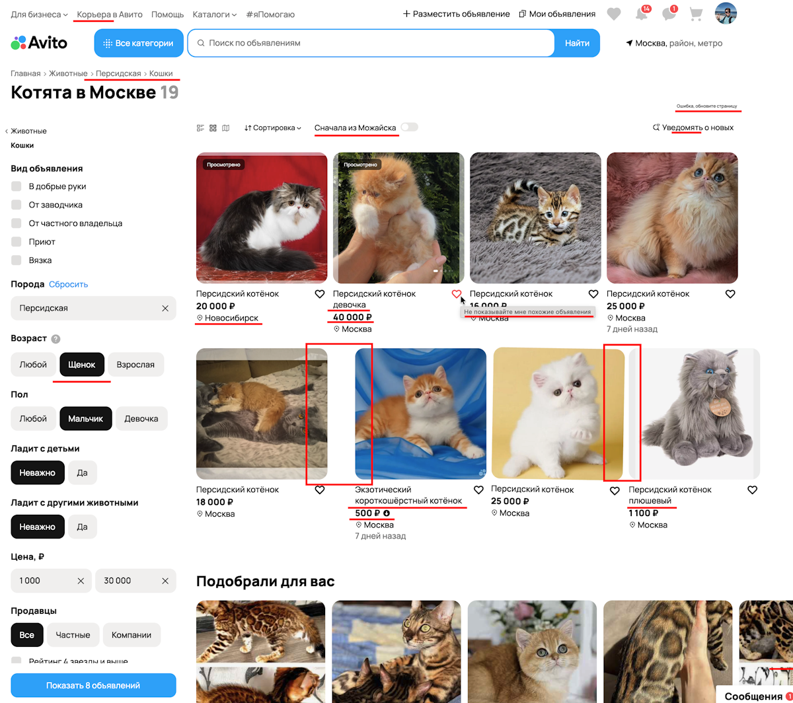

# Репозиторий с заданиями для QA-trainee

## Содержание
- [Общая структура](#общая-структура)
- [Выполнение задания 1](#выполнение-задания-1)
- [Выполнение задания 2](#выполнение-задания-2)

### Общая структура
```
internship-QA/
├── .git/                           
├── images/                        # Скриншоты
├── Task1/                         # Задание 1
│   └── Task1.md                   # Отчет по заданию 1
├── Task2/                         # Задание 2
│   └── ...                        # (структура находится в [readme.md](./Task2/README.md#) в папке Task2)
└── README.md                      # Основной README файл
```
### Выполнение задания 1

Требовалось найти все баги на скриншоте страницы поиска. Выполнение находится в файле [Task1.md](Task1/Task1.md#)

Примененные инструменты:
- [PerfectPixel](https://chromewebstore.google.com/detail/perfectpixel-by-welldonec/dkaagdgjmgdmbnecmcefdhjekcoceebi)


> Найденные баги выделены

### Выполнение задания 2

Выбран вариант 2.1.

Требовалось протестировать микросервис с 4-мя эндпоинтами. 

Тест-кейсы находятся в файле [TESTCASES.md](Task2/TESTCASES.md) в свёрнутом виде.

E2E тест-кейсы находятся в файле [E2E-TESTCASES.md](Task2/E2E-TESTCASES.md).

Баг-репорты находятся в файле [BUGS.md](Task2/BUGS.md).

Примененные инструменты:
- [Java 21](https://www.oracle.com/java/technologies/javase/jdk21-archive-downloads.html) (автоматизация)
- [Allure](https://allurereport.org/) (отчет)
- [k6](https://k6.io/) (нагрузочное тестирование)

Вся информация о структуре задания, запуске, скриншоты и пояснения находятся в [readme.md](./Task2/README.md#) в папке Task2.