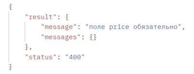
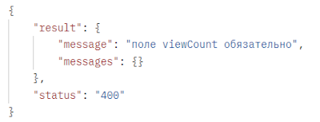
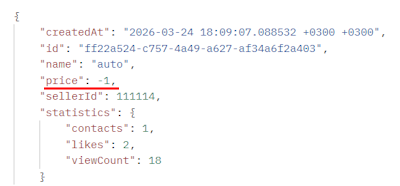
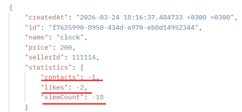
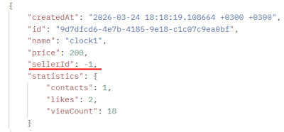
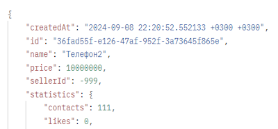
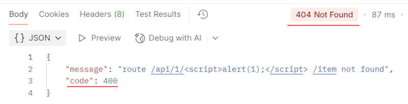

# Список баг-репортов для микросервиса

Содержит баг-репорты для ошибок, найденных в API с помощью тест-кейсов.

**Окружение:** Postman Version 11.85.0

**Приоритет бага**:
- Наивысший. Необходимость устранить дефект настолько быстро, насколько это возможно.
- Высокий. Дефект следует исправить вне очереди, так как его существование мешает работе основного функционала.
- Средний. Дефект следует исправить в порядке общей очередности.
- Низкий. Исправление данного дефекта не окажет существенного влияния на функционал.

**Серьезность бага**:
- Критическая. Критический баг. Эндпоинт не выполняет ключевой функционал.
- Высокая. Существование дефекта приносит ощутимые неудобства в процессе типичной деятельности.
- Средняя. Существование дефекта практически не влияет на процесс типичной деятельности.
- Низкая. Существование дефекта редко обнаруживается незначительным процентом пользователей.

## Содержание
- [Баг-репорты создания объявлений](#баг-репорты-создания-объявлений)
- [Баг-репорты получения объявлений по идентификатору продавца](#баг-репорты-получения-объявлений-по-идентификатору-продавца)

## Баг-репорты создания объявлений

### Нулевое значение поля price

**Дата тестирования**: 23.03.2026

**Имя тестировщика**: Страшко Р.

|                        |                                                                                                                                            |
|------------------------|--------------------------------------------------------------------------------------------------------------------------------------------|
| ID                     | BUG_01                                                                                                                                     |
| Название               | Нулевое значение поля price                                                                                                                |
| Описание               | POST API не принимает нулевое значение поля price для создания бесплатных объявлений                                                       |
| Теги                   | создание объявлений, price                                                                                                                 |
| Статус                 | новый                                                                                                                                      |
| Приоритет (priority)   | средний                                                                                                                                    |
| Серьёзность (severity) | средняя                                                                                                                                    |
| Шаги воспроизведения   | 1. Отправить POST-запрос на `/api/1/item` с price = 0  2. Проверить тело ответа                                                         |
| Ожидаемый результат    | Запрос принят для создания объявления с нулевой (бесплатной) ценой                                                                         |
| Фактический результат  | Получен статус код 400 Bad Request с сообщением "поле price обязательно"                                                                   |
| Приложение             |  Поле price <code>Ноль не принят</code> |

<h3 style="display: inline;" id="BUG-02">Нулевое значение поля viewCount</h3>

**Дата тестирования**: 23.03.2026

**Имя тестировщика**: Страшко Р.

|                        |                                                                                        |
|------------------------|----------------------------------------------------------------------------------------|
| ID                     | BUG_02                                                                                 |
| Название               | Нулевое значение поля viewCount                                                        |
| Описание               | POST API не принимает нулевое значение поля viewCount                                  |
| Теги                   | создание объявлений, viewCount                                                         |
| Статус                 | новый                                                                                  |
| Приоритет (priority)   | средний                                                                                |
| Серьёзность (severity) | средняя                                                                                |
| Шаги воспроизведения   | 1. Отправить POST-запрос на `/api/1/item` с viewCount = 0  2. Проверить тело ответа |
| Ожидаемый результат    | Запрос принят для создания объявления с нулевым количеством просмотров                 |
| Фактический результат  | Получен статус код 400 Bad Request с сообщением "поле viewCount обязательно"           |
| Приложение             |  Поле viewCount <code>Ноль не принят</code> |

### Отрицательное значение поля price

**Дата тестирования**: 23.03.2026

**Имя тестировщика**: Страшко Р.

|                        |                                                                                                |
|------------------------|------------------------------------------------------------------------------------------------|
| ID                     | BUG_03                                                                                         |
| Название               | Отрицательное значение поля price                                                              |
| Описание               | POST API принимает отрицательное значение поля price, позволяя задавть цены объявлениям ниже 0 |
| Теги                   | создание объявлений, price                                                                     |
| Статус                 | новый                                                                                          |
| Приоритет (priority)   | средний                                                                                        |
| Серьёзность (severity) | средняя                                                                                        |
| Шаги воспроизведения   | 1. Отправить POST-запрос на `/api/1/item` с price = -1  2. Проверить тело ответа            |
| Ожидаемый результат    | Запрос не принят с предупреждением о невалидном значении price                                 |
| Фактический результат  | Получен статус код 200 OK с сообщением "Сохранили объявление - {идентификатор объявления}"    |
| Приложение             |  Поле price <code>Отрицательное значение</code> |

### Отрицательные значения полей statistics 

**Дата тестирования**: 23.03.2026

**Имя тестировщика**: Страшко Р.

|                        |                                                                                                                     |
|------------------------|---------------------------------------------------------------------------------------------------------------------|
| ID                     | BUG_04                                                                                                              |
| Название               | Отрицательные значения полей statistics                                                                             |
| Описание               | POST API принимает отрицательные значения полей statistics (likes, viewCount, contacts)                             |
| Теги                   | создание объявлений, statistics                                                                                     |
| Статус                 | новый                                                                                                               |
| Приоритет (priority)   | средний                                                                                                             |
| Серьёзность (severity) | средняя                                                                                                             |
| Шаги воспроизведения   | 1. Отправить POST-запрос на `/api/1/item` с likes = -2, viewCount = -18, contacts= -1   2. Проверить тело ответа |
| Ожидаемый результат    | Запрос не принят с предупреждением о невалидных значениях во всех полях statistics                                  |
| Фактический результат  | Получен статус код 200 OK с сообщением "Сохранили объявление - {идентификатор объявления}"                         |
| Приложение             |  Поля statistics <code>Отрицательные значения</code> |

### Отрицательное значение поля sellerId

**Дата тестирования**: 23.03.2026

**Имя тестировщика**: Страшко Р.

|                        |                                                                                             |
|------------------------|---------------------------------------------------------------------------------------------|
| ID                     | BUG_05                                                                                      |
| Название               | Отрицательное значение поля sellerId                                                        |
| Описание               | POST API принимает отрицательное значение поля sellerId                                     |
| Теги                   | создание объявлений, sellerId                                                               |
| Статус                 | новый                                                                                       |
| Приоритет (priority)   | средний                                                                                     |
| Серьёзность (severity) | средняя                                                                                     |
| Шаги воспроизведения   | 1. Отправить POST-запрос на `/api/1/item` с sellerId = -1   2. Проверить тело ответа     |
| Ожидаемый результат    | Запрос не принят с предупреждением о невалидном значении поля sellerId                     |
| Фактический результат  | Получен статус код 200 OK с сообщением ""Сохранили объявление - {идентификатор объявления}" |
| Приложение             |  Поле сохранилось как отрицательное <code>SellerId отрицательный</code> |

## Баг-репорты получения объявлений по идентификатору продавца
### Получение объявлений по невалидному sellerId

**Дата тестирования**: 23.03.2026

**Имя тестировщика**: Страшко Р.

|                        |                                                                                                                                       |
|------------------------|---------------------------------------------------------------------------------------------------------------------------------------|
| ID                     | BUG_06                                                                                                                                |
| Название               | Получение объявлений по невалидному sellerId                                                                                          |
| Описание               | GET API возвращает 200 OK при запросе с отрицательным sellerId                                                                        |
| Теги                   | получение объявлений, sellerId                                                                                                        |
| Статус                 | новый                                                                                                                                 |
| Приоритет (priority)   | средний                                                                                                                               |
| Серьёзность (severity) | средняя                                                                                                                               |
| Шаги воспроизведения   | 1. Отправить GET-запрос на `/api/1/{sellerId}/item` с sellerId = {отрицательный идентификатор продавца}   2. Проверить тело ответа |
| Ожидаемый результат    | Получен статус код 400 Bad Request. Запрос не принят с предупреждением о невалидном значении поля sellerId                           |
| Фактический результат  | Получен статус код 200 OK со всеми объявлениями продавца                                                                              |
| Приложение             |  Объявления есть <code>SellerId отрицательный</code> |

### Несоответствие кодов при XSS

**Дата тестирования**: 23.03.2026

**Имя тестировщика**: Страшко Р.

|                        |                                                                                                                                                                       |
|------------------------|-----------------------------------------------------------------------------------------------------------------------------------------------------------------------|
| ID                     | BUG_07                                                                                                                                                                |
| Название               | Несоответствие кодов при XSS                                                                                                                                          |
| Описание               | GET API принимает запрос с XSS и возвращает разные статус-коды                                                                                                        |
| Теги                   | получение объявлений, sellerId, XSS                                                                                                                                   |
| Статус                 | новый                                                                                                                                                                 |
| Приоритет (priority)   | низкий                                                                                                                                                                |
| Серьёзность (severity) | низкая                                                                                                                                                                |
| Шаги воспроизведения   | 1. Отправить GET-запрос на `/api/1/{sellerId}/item` с sellerId = ``   2. Проверить тело ответа   3. Сравнить возвращённые статус-коды |
| Ожидаемый результат    | Код в теле ответа в JSON-формате совпадает с HTTP-статус кодом, возвращенным Postman                                                                                  |
| Фактический результат  | Получен статус код 400 Bad Request в теле ответа, а HTTP-статус код Postman 404 Not Found                                                                          |
| Приложение             |  Код 400 <code>При коде 404 Not Found</code> |

