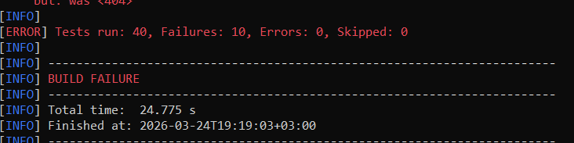
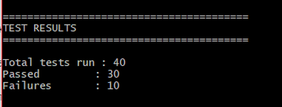
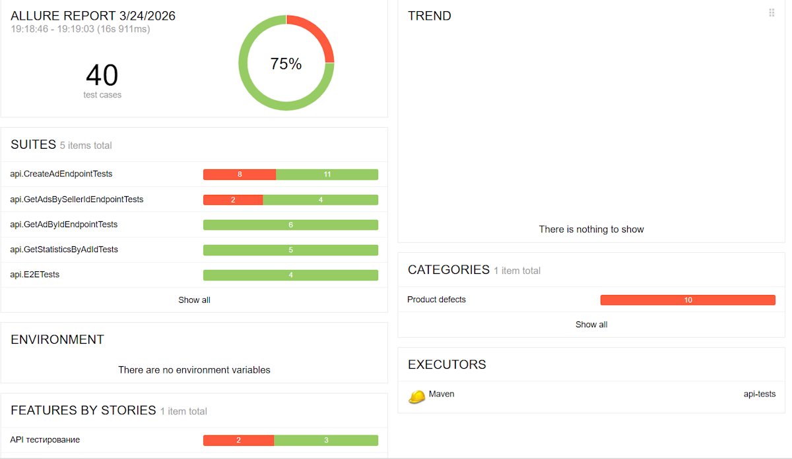
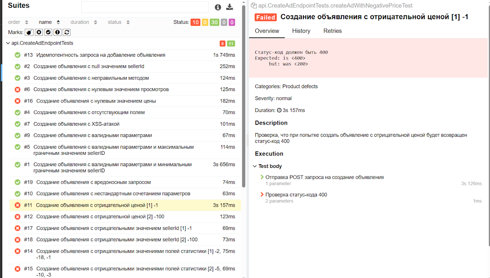
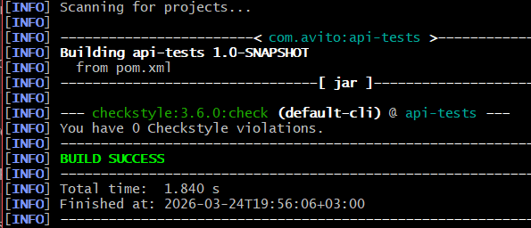
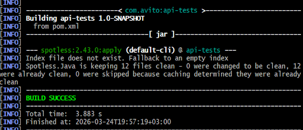

## Раздел Task 2
Содержит выполнение задания 2 с тестированием 4-ёх эндпоинтов для микросервиса, работающего с объявлениями.

- [Тест-кейсы](TESTCASES.md#) хранятся в соответствующем файле в свёрнутом виде.
- [E2E Тест-кейсы](E2E-TESTCASES.md#) хранятся в соответствующем файле в свёрнутом виде.
- [Баг-репорты](BUGS.md#) хранятся в соответствующем файле в табличном формате.

### Содержание
- [Структура проекта](#структура-проекта)
- [Инструкция для запуска автоматических тестов](#инструкция-для-запуска-автоматических-тестов)
- [Пример выполнения тестов в cmd/bash](#пример-выполнения-тестов-в-cmdbash)
- [Инструкция для запуска тестов на производительность](#инструкция-для-запуска-тестов-на-производительность)
- [Инструкция по Allure](#инструкция-по-allure)
- [Пример отчёта Allure](#пример-отчёта-allure)
- [Линтер и форматтер](#линтер-и-форматтер)
- [Примеры выводов линтера и форматтера](#примеры-выводов-линтера-и-форматтера)

### Структура проекта
```
Task2/
├── images/                          # Скриншоты
├── load_tests/                      # Нагрузочные тесты
├── test-automation/                 # Автотесты API
│   ├── .allure/                     # Allure-результаты
│   ├── .idea/                       
│   ├── .mvn/                        
│   ├── src/
│   │   └── test/
│   │       └── java/
│   │           └── api/
│   │               ├── dto/
│   │               │   ├── AdCreationRequestDto.java           # Класс содержит DTO для создания объявления. Используется для сериализации
│   │               │   ├── AdResponseDto.java                  # Класс содержит DTO для получения объявления. Используется для сериализации
│   │               │   └── StatisticResponseDto.java           # Класс содержит DTO для работы с полями статистики. Используется для сериализации
│   │               ├── util/
│   │               │   ├── CommonMethods.java                  # Класс содержит общие для нескольких наборов тестов методы
│   │               │   ├── DataGenerator.java                  # Класс содержит методы для генерации случайных данных
│   │               │   └── Constants.java                      # Класс содержит константы для API
│   │               ├── CreateAdEndpointTests.java              # Класс содержит автоматизированные тест-кейсы создания объявления
│   │               ├── E2ETests.java                           # Класс содержит автоматизированные E2E тест-кейсы работы с эндпоинтами микросервиса объявлений
│   │               ├── GetAdByIdEndpointTests.java             # Класс содержит автоматизированные тест-кейсы получения объявления по уникальному идентификатору объявления
│   │               ├── GetAdsBySellerIdEndpointTests.java      # Класс содержит автоматизированные тест-кейсы получения объявлений по идентификатору продавца (sellerId)
│   │               ├── GetStatisticsByAdIdTests.java           # Класс содержит автоматизированные тест-кейсы получения статистики объявления по уникальному идентификатору объявления
│   │               └── TestRunner.java                         # Класс для единовременного запуска всех наборов тестов из IntelliJ IDEA
│   ├── target/                      # Сборка и отчёты
│   ├── .gitignore
│   ├── allure-example.html          # Пример Allure-отчёта
│   ├── checkstyle.xml               # Конфигурация линтера
│   ├── mvnw                         # Maven Wrapper для bash (Linux)
│   ├── mvnw.cmd                     # Maven Wrapper для консоли (Windows)
│   └── pom.xml                      # Maven конфигурация
├── avito-qa-internship.json         # Postman коллекция (та же, что и в задании)
├── BUGS.md                          # Баг-репорты
├── E2E-TESTCASES.md                 # E2E тест-кейсы
├── README.md                        
├── TESTCASES.md                     # Все тест-кейсы
├── run_tests.bat                    # Скрипт запуска для консоли (Windows)
└── run_tests.sh                     # Скрипт запуска для bash терминала (Linux)
```


### Инструкция для запуска автоматических тестов
**Технологии:** Java 21

**Зависимости (устанавливаются автоматически через Maven):**
- jackson 2.17.0
- rest-assured 5.5.0
- junit-platform-suite 1.10.0
- junit.jupiter 5.10.0
- aspectj 1.9.22.1
- allure 2.29.1

**Операционная система:** Windows (также приложен скрипт для bash)

#### Стандартный запуск 

1. Склонируйте репозиторий проекта по ссылке командой:
```
git clone git@github.com:FantasmaDux/intership-QA.git
```

Или используйте следующую команду, если не настроен ssh:
```
git clone https://github.com/FantasmaDux/intership-QA.git
```

Или скачайте архив проекта по [ссылке](https://github.com/FantasmaDux/intership-QA/archive/refs/heads/main.zip)

2. Убедитесь, что у вас установлена java. Для этого откройте командную строку и выполните команду:
```
javac -version
```

Вывод должен выглядеть примерно так:
```
javac 21.0.9 (ваша версия)
```

Иначе требуется установить java. Для этого есть два способа:
- Устанавливаем Windows X64 installer по [прямой ссылке](https://download.oracle.com/java/21/archive/jdk-21.0.9_windows-x64_bin.exe)
- Или переходим на сайт [Oracle](https://www.oracle.com/java/technologies/javase/jdk21-archive-downloads.html) и выбираем JDK 21. При установке обязательно отметьте опцию "Add to PATH", чтобы у консоли был доступ к java.

Повторно выполняем
```
javac -version
```

3. Переходим в каталог Task2 и открываем в нем консоль

4. Запускаем скрипт командой:
```
run_tests.bat
```

Скрипт запустит автоматические тесты, откроет браузер по умолчанию с отчетом

5. Если есть возможность использовать bash, в каталоге Task2 выполняются следующие команды.

Для выдачи прав на запуск:
```
chmod +x ./run_tests.sh
```

И для запуска:
```
./run_tests.sh
```

Скрипт запустит автоматические тесты, откроет браузер по умолчанию с отчетом

#### Если необходимо запустить тесты вручную, выполняем следующие команды
1. Переходим в каталог test-automation
```
cd test-automation
```
2. Выполняем в консоли Windows команду:
```
mvnw.cmd test
```

Или в терминале bash:
```
./mvnw test 
```

#### Возможные ошибки
Если возникнет проблема с Maven, нужно сделать следующее:
1. Зайти на сайт https://maven.apache.org/download.cgi
2. Скачать Binary zip archive - apache-maven-3.9.14-bin.zip самостоятельно или по [ссылке](https://dlcdn.apache.org/maven/maven-3/3.9.14/binaries/apache-maven-3.9.14-bin.zip)
3. Распаковать архив в любой каталог без русских символов
4. Добавить maven в переменные среды Path (win + r -> sysdm.cpl -> переменные среды -> Path -> добавить путь к каталогу bin, который лежит в разархивированном каталоге)
5. Перезагрузить терминал
6. Запустить скрипт

### Пример выполнения тестов в cmd/bash


> Вывод после запуска тестов в консоли Windows. 


> Вывод после запуска тестов в терминале bash. 


**Пояснения к результатам:** в баг-репорте указано 7 багов, но автоматические тесты показывают 10. Причина в том, что для трех багов используются 
параметризированные тесты с перебором входных параметров. Среди этих тестов: 
- createAdWithNegativeStatisticsTest - Создание объявления с отрицательными значениями полей статистики
- createAdWithNegativeSellerIdTest - Создание объявления с отрицательными значением sellerId
- createAdWithNegativePriceTest - Создание объявления с отрицательной ценой
Все эти баги занесены в баг-репорт, поэтому настоящее число багов равно 7, как и указано в баг-репорте.

### Инструкция для запуска тестов на производительность
**Примечание:** выполнение этих шагов необязательно, тестирование производительности не включено в список автоматизированных тестов. Скриншоты тестирования производительности есть в соответствующих тест-кейсах.

**Требование для запуска:** установлен k6 для нагрузочного тестирования

1. Для установки переходим на [сайт](https://grafana.com/docs/k6/latest/set-up/install-k6/) или качаем установщик по [ссылке](https://dl.k6.io/msi/k6-latest-amd64.msi)
2. После установки по очереди запускаем скрипты из каталога load_tests
Команды для запуска:
```
k6 run ./load_tests/load-test-ca.js
```

```
k6 run ./load_tests/load-test-gabi.js
```

```
k6 run ./load_tests/load-test-gabs.js
```

```
k6 run ./load_tests/load-test-gs.js
```

### Инструкция по Allure

Отчет по результатам проверок уже приложен и находится в каталоге Task2, но чтобы его открыть, нужно использовать те же команды, что и для отдельной генерации. 

1. Перейдите в каталог test-automation
```
cd test-automation
```
2. Выполните в консоли Windows команду:
```
start cmd /k mvnw.cmd allure:serve --no-transfer-progress
```
Или в терминале bash:
```
./mvnw allure:serve
```

При запуске скриптов отчет откроется сам.  

### Пример отчёта Allure

> Главная страница со статистикой 


> Страница со всеми кейсами


### Линтер и форматтер

Правила с пояснениями указаны в конфиге checkstyle.xml в корне проекта (test-automation). 

#### Для запуска линтера на Windows выполните следующие команды
1. Перейдите в корень проекта
```
cd test-automation
```
2. Выполните команду
```
mvnw.cmd checkstyle:check
```

#### Для запуска линтера в терминале bash выполните следующие команды
1. Перейдите в корень проекта
```
cd test-automation
```
2. Выполните команду
```
./mvnw checkstyle:check
```

#### Для запуска форматтера на Windows выполните следующие команды
1. Перейдите в корень проекта
```
cd test-automation
```
2. Выполните команду
```
mvnw.cmd spotless:apply
```

#### Для запуска форматтера в терминале bash выполните следующие команды
1. Перейдите в корень проекта
```
cd test-automation
```
2. Выполните команду
```
./mvnw spotless:apply
```

### Примеры выводов линтера и форматтера

> Вывод линтера 

Линтер выдаст ошибки, если нарушены правила из конфигурации checkstyle.xml.


> Вывод форматтера

Форматтер приведет код к Google Style