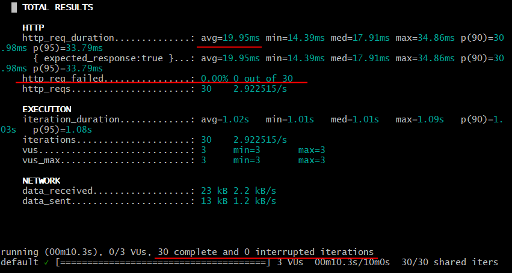
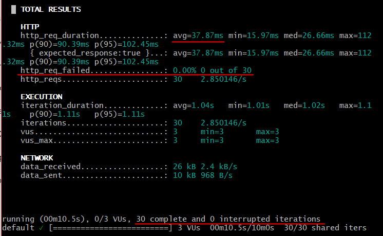
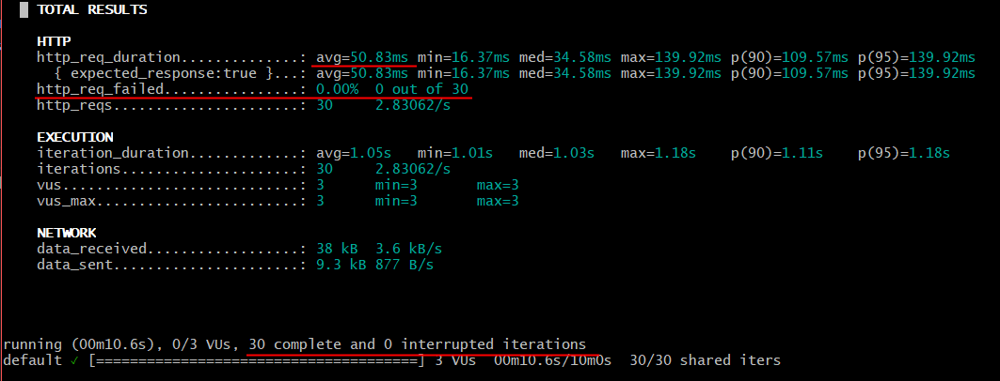
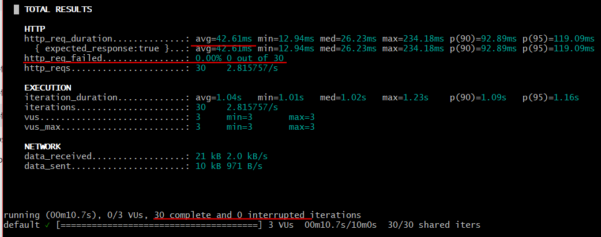

# Список тест-кейсов для микросервиса

Содержит тест-кейсы для проверки микросервиса Авито. Микросервис содержит 4 эндпоинта:
- Создать объявления
- Получить объявления по его идентификатору
- Получить все объявления по идентификатору продавца
- Получить статистику по айтем ID

Host: https://qa-internship.avito.com

**Окружение:** Postman Version 11.85.0

**Общие предусловия:**
- импортировать postman коллекцию запросов avito-qa-internship.json

**Приоритеты проверок**:
- Высокий. Если функциональность не работает, найден критический баг. Соответствует основной позитивной проверке.
- Средний. Важная часть логики эндпоинта.
- Низкий. Второстепенная и редко используемая логика эндпоинта.

**Правила именования идентификаторов тест-кейсов:**
Пример: TC_CA_01

- TC (test case) - тип документа
- CA (create ad) - первые буквы проверяемого типа эндпоинта
- 01 номер теста - первые буквы проверяемого типа эндпоинта

Все сокращения:
- CA (create ad)
- GABI (get ad by ID)
- GABS (get ad by sellerId)
- GS (get statisitcs)

## Применяемые техники тест-дизайна:
- Эквивалентное разбиение
- Граничные значения

## Содержание
- [Общая статистика по тест-кейсам](#общая-статистика-по-тест-кейсам)
- [1. Тест-кейсы создания объявлений](#тест-кейсы-создания-объявлений)
- [2. Тест-кейсы получения объявления по его идентификатору](#тест-кейсы-получения-объявлений-по-его-идентификатору)
- [3. Тест-кейсы получения объявлений по идентификатору продавца](#тест-кейсы-получения-объявлений-по-идентификатору-продавца)
- [4. Тест-кейсы получения статистики](#тест-кейсы-получения-статистики)

## Общая статистика по тест-кейсам

| Эндпоинт                                        | Позитивные тесты | Негативные тесты | Корнер-тесты | Функциональные тесты (всего) | Нефункциональные тесты | Всего |
|-------------------------------------------------|------------------|------------------|--------------|------------------------------|------------------------|-------|
| Создание объявлений                             | 5                | 7                | 2            | 14                           | 3                      | 17    |
| Получения объявления по его идентификатору      | 2                | 3                | 1            | 6                            | 1                      | 7     |
| Получения объявлений по идентификатору продавца | 1                | 3                | 1            | 5                            | 2                      | 7     |
| Получение статистики                            | 1                | 3                | 1            | 5                            | 1                      | 6     |

**Всего багов найдено:** 7

**Функциональные тесты состоят из:**
- Позитивные тесты
- Негативные тесты
- Корнер-тесты

**Нефункциональные тесты состоят из:**
- Тесты производительности
- Тесты безопасности

## Тест-кейсы создания объявлений

Запрос: https://qa-internship.avito.com/api/1/item

### • Функциональные тесты


#### Позитивные тесты
<details><summary><h4 style="display: inline; ">Тест-кейс создания объявления с валидными параметрами</h4></summary>

**Идентификатор**: TC_CA_01

**Приоритет**: высокий

**Описание**: создание объявления с валидными параметрами

**Тестовые данные**:
```
{
  "sellerID": 111113,
  "name": "auto",
  "price": 120000,
  "statistics": {
    "likes": 2,
    "viewCount": 18,
    "contacts": 1
  }
}
```

**Предусловия**: - 

| Номер шага | Шаг                                       | Ожидаемый результат                                      |
|------------|-------------------------------------------|----------------------------------------------------------|
| 1          | Отправить POST запрос создания объявления | Получен код 200 OK                                       |
| 2          | Проверить тело ответа                     | Тело ответа содержит идентификатор созданного объявления |

**Статус**: пройдено

**Приложение**: -
</details>

<details><summary><h4 style="display: inline; ">Тест-кейс создания объявления с валидными параметрами и минимальным граничным значением sellerID</h4></summary>

**Идентификатор**: TC_CA_02

**Приоритет**: высокий

**Описание**: создание объявления с валидными параметрами

**Тестовые данные**:
```
{
  "sellerID": 111111,
  "name": "auto",
  "price": 120000,
  "statistics": {
    "likes": 2,
    "viewCount": 18,
    "contacts": 1
  }
}
```

**Предусловия**: - 

| Номер шага | Шаг                                       | Ожидаемый результат                                      |
|------------|-------------------------------------------|----------------------------------------------------------|
| 1          | Отправить POST запрос создания объявления | Получен код 200 OK                                       |
| 2          | Проверить тело ответа                     | Тело ответа содержит идентификатор созданного объявления |

**Статус**: пройдено

**Приложение**: -
</details>

<details><summary><h4 style="display: inline; ">Тест-кейс создания объявления с валидными параметрами и максимальным граничным значением sellerID</h4></summary>

**Идентификатор**: TC_CA_03

**Приоритет**: высокий

**Описание**: создание объявления с валидными параметрами

**Тестовые данные**:
```
{
  "sellerID": 999999,
  "name": "auto",
  "price": 120000,
  "statistics": {
    "likes": 2,
    "viewCount": 18,
    "contacts": 1
  }
}
```

**Предусловия**: - 

| Номер шага | Шаг                                       | Ожидаемый результат                                      |
|------------|-------------------------------------------|----------------------------------------------------------|
| 1          | Отправить POST запрос создания объявления | Получен код 200 OK                                       |
| 2          | Проверить тело ответа                     | Тело ответа содержит идентификатор созданного объявления |

**Статус**: пройдено

**Приложение**: -
</details>

<details><summary><h4 style="display: inline; ">Тест-кейс c нулевым значением цены</h4></summary>

**Идентификатор**: TC_CA_04

**Приоритет**: средний

**Описание**: создание объявления с граничным валидным значением price, равным нулю

**Тестовые данные**:
```
{
  "sellerID": 111114,
  "name": "auto",
  "price": 0,
  "statistics": {
    "likes": 2,
    "viewCount": 18,
    "contacts": 1
  }
}
```

**Предусловия**: - 

| Номер шага | Шаг                                       | Ожидаемый результат                                      |
|------------|-------------------------------------------|----------------------------------------------------------|
| 1          | Отправить POST запрос создания объявления | Получен код 200 OK                                       |
| 2          | Проверить тело ответа                     | Тело ответа содержит идентификатор созданного объявления |

**Статус**: не пройдено

**Приложение**: 
BUG-ID: BUG_01
</details>

<details><summary><h4 style="display: inline; ">Тест-кейс c нулевым значением просмотров</h4></summary>

**Идентификатор**: TC_CA_05

**Приоритет**: средний

**Описание**: создание объявления с граничным валидным значением viewCount, равным нулю

**Тестовые данные**:
```
{
  "sellerID": 111114,
  "name": "auto",
  "price": 1,
  "statistics": {
    "likes": 2,
    "viewCount": 0,
    "contacts": 1
  }
}
```

**Предусловия**: - 

| Номер шага | Шаг                                       | Ожидаемый результат                                      |
|------------|-------------------------------------------|----------------------------------------------------------|
| 1          | Отправить POST запрос создания объявления | Получен код 200 OK                                       |
| 2          | Проверить тело ответа                     | Тело ответа содержит идентификатор созданного объявления |

**Статус**: не пройдено

**Приложение**: 
BUG-ID: BUG_02
</details>

---

#### Негативные тесты
<details><summary><h4 style="display: inline; ">Тест-кейс c null значением</h4></summary>

**Идентификатор**: TC_CA_06

**Приоритет**: средний

**Описание**: создание объявления с невалидным значением sellerID, равным null

**Тестовые данные**:
```
{
  "sellerID": null,
  "name": "auto",
  "price": 120000,
  "statistics": {
    "likes": 2,
    "viewCount": 18,
    "contacts": 1
  }
}
```

**Предусловия**: - 

| Номер шага | Шаг                                       | Ожидаемый результат                                                      |
|------------|-------------------------------------------|--------------------------------------------------------------------------|
| 1          | Отправить POST запрос создания объявления | Получен код 400 Bad Request                                              |
| 2          | Проверить тело ответа                     | Тело ответа содержит предупреждение о том, что поле sellerID обязательно |

**Статус**: пройдено

**Приложение**: -
</details>

<details><summary><h4 style="display: inline; ">Тест-кейс c отрицательным значением цены</h4></summary>

**Идентификатор**: TC_CA_07

**Приоритет**: средний

**Описание**: создание объявления с невалидным значением price, равным отрицательному числу

**Тестовые данные**:
```
{
  "sellerID": 111114,
  "name": "auto",
  "price": -1,
  "statistics": {
    "likes": 2,
    "viewCount": 18,
    "contacts": 1
  }
}
```

**Предусловия**: - 

| Номер шага | Шаг                                       | Ожидаемый результат                                                                   |
|------------|-------------------------------------------|---------------------------------------------------------------------------------------|
| 1          | Отправить POST запрос создания объявления | Получен код 400 Bad Request                                                           |
| 2          | Проверить тело ответа                     | Тело ответа содержит предупреждение о том, что поле price не может быть отрицательным |

**Статус**: не пройдено

**Приложение**: 
BUG-ID: BUG_03
</details>


<details><summary><h4 style="display: inline; ">Тест-кейс c пустым значением</h4></summary>

**Идентификатор**: TC_CA_08

**Приоритет**: средний

**Описание**: создание объявления с невалидным значением name, равным пустой строке

**Тестовые данные**:
```
{
  "sellerID": 111114,
  "name": "",
  "price": 200,
  "statistics": {
    "likes": 2,
    "viewCount": 18,
    "contacts": 1
  }
}
```

**Предусловия**: - 

| Номер шага | Шаг                                       | Ожидаемый результат                                                  |
|------------|-------------------------------------------|----------------------------------------------------------------------|
| 1          | Отправить POST запрос создания объявления | Получен код 400 Bad Request                                          |
| 2          | Проверить тело ответа                     | Тело ответа содержит предупреждение о том, что поле name обязательно |

**Статус**: пройдено

**Приложение**: 
</details>

<details><summary><h4 style="display: inline; ">Тест-кейс c отсутствующим полем</h4></summary>

**Идентификатор**: TC_CA_09

**Приоритет**: средний

**Описание**: создание объявления с отсутствующим (закомментированным) полем contacts

**Тестовые данные**:
```
{
  "sellerID": 111114,
  "name": "clock",
  "price": 200,
  "statistics": {
    "likes": 2,
    "viewCount": 18
    // "contacts": 1
  }
}
```

**Предусловия**: - 

| Номер шага | Шаг                                       | Ожидаемый результат                                                      |
|------------|-------------------------------------------|--------------------------------------------------------------------------|
| 1          | Отправить POST запрос создания объявления | Получен код 400 Bad Request                                              |
| 2          | Проверить тело ответа                     | Тело ответа содержит предупреждение о том, что поле contacts обязательно |

**Статус**: пройдено

**Приложение**: -
</details>

<details><summary><h4 style="display: inline; ">Тест-кейс c неправильным методом</h4></summary>

**Идентификатор**: TC_CA_10

**Приоритет**: средний

**Описание**: создание объявления с использованием GET метода вместо POST

**Тестовые данные**:
```
{
  "sellerID": 111114,
  "name": "clock",
  "price": 200,
  "statistics": {
    "likes": 2,
    "viewCount": 18,
    "contacts": 1
  }
}
```

**Предусловия**: - 

| Номер шага | Шаг                                          | Ожидаемый результат                |
|------------|----------------------------------------------|------------------------------------|
| 1          | Отправить GET запрос для создания объявления | Получен код 405 Method Not Allowed |

**Статус**: пройдено

**Приложение**: -
</details>

<details><summary><h4 style="display: inline; ">Тест-кейс c отрицательными значениями всех полей statistics</h4></summary>

**Идентификатор**: TC_CA_11

**Приоритет**: средний

**Описание**: создание объявления с отрицательными значениями всех полей statistics (likes, viewCount, contacts)

**Тестовые данные**:
```
{
  "sellerID": 111114,
  "name": "clock",
  "price": 200,
  "statistics": {
    "likes": -2,
    "viewCount": -18,
    "contacts": -1
  }
}
```

**Предусловия**: - 

| Номер шага | Шаг                                       | Ожидаемый результат                                                                   |
|------------|-------------------------------------------|---------------------------------------------------------------------------------------|
| 1          | Отправить POST запрос создания объявления | Получен код 400 Bad Request                                                           |
| 2          | Проверить тело ответа                     | Тело ответа содержит сообщение о невалидном значении статистики (отрицательные числа) |

**Статус**: не пройдено

**Приложение**: 
BUG-ID: BUG_04
</details>


<details><summary><h4 style="display: inline; ">Тест-кейс c отрицательным значением поля sellerID</h4></summary>

**Идентификатор**: TC_CA_12

**Приоритет**: средний

**Описание**: создание объявления с отрицательными значением поля sellerID

**Тестовые данные**:
```
  {
    "sellerID": -1,
    "name": "clock1",
    "price": 200,
    "statistics": { 
        "likes": 2,
        "contacts": 1,
        "viewCount": 18
      }
  }
```

**Предусловия**: - 

| Номер шага | Шаг                                       | Ожидаемый результат                                                                      |
|------------|-------------------------------------------|------------------------------------------------------------------------------------------|
| 1          | Отправить POST запрос создания объявления | Получен код 400 Bad Request                                                              |
| 2          | Проверить тело ответа                     | Тело ответа содержит предупреждение о том, что поле sellerID не может быть отрицательным |

**Статус**: не пройдено

**Приложение**: 
BUG-ID: BUG_05
</details>

---

#### Корнер-тесты

<details><summary><h4 style="display: inline; ">Тест-кейс идемпотентности запроса на добавление объявления</h4></summary>

**Идентификатор**: TC_CA_13

**Приоритет**: средний

**Описание**: создание объявления сразу после отправления идентичного запроса

**Тестовые данные**:
```
{
  "sellerID": 111114,
  "name": "clock",
  "price": 200,
  "statistics": {
    "likes": 2,
    "viewCount": 18,
    "contacts": 1
  }
}
```

**Предусловия**: 
- Идентичный запрос был отправлен единожды сразу до отправки тестовых данных текущего тест-кейса

| Номер шага | Шаг                                       | Ожидаемый результат                                                                  |
|------------|-------------------------------------------|--------------------------------------------------------------------------------------|
| 1          | Отправить POST запрос создания объявления | Получен код 200 OK                                                                   |
| 2          | Проверить тело ответа                     | Получено тело ответа с идентификатором, ошибки или неожиданное поведение отсутствуют |

**Статус**: пройдено
**Приложение**: -
</details>

<details><summary><h4 style="display: inline; ">Тест-кейс нестандартного сочетания параметров</h4></summary>

**Идентификатор**: TC_CA_14

**Приоритет**: средний

**Описание**: все параметры валидны, но нестандартны и содержат редкие сочетания

**Тестовые данные**:
```
{
  "sellerID": 999999,
  "name": "#$%_y!%^:",
  "price": 2147483647,
  "statistics": {
    "likes": 9999,
    "viewCount": 1,
    "contacts": 1
  }
}
```

**Предусловия**: -

| Номер шага | Шаг                                       | Ожидаемый результат                                                                  |
|------------|-------------------------------------------|--------------------------------------------------------------------------------------|
| 1          | Отправить POST запрос создания объявления | Получен код 200 OK                                                                   |
| 2          | Проверить тело ответа                     | Получено тело ответа с идентификатором, ошибки или неожиданное поведение отсутствуют |

**Статус**: пройдено
**Приложение**: -
</details>

---

### • Нефункциональные тесты


#### Тестирование производительности
<details><summary><h4 style="display: inline; ">Тест-кейс определения времени отклика создания объявления под нагрузкой</h4></summary>

**Идентификатор**: TC_CA_15

**Приоритет**: средний

**Описание**: определение времени отклика при нагрузке через k6 

**Тестовые данные**:
```
{
  "sellerID": 111114,
  "name": "clock",
  "price": 200,
  "statistics": {
    "likes": 2,
    "viewCount": 18,
    "contacts": 1
  }
}
```

**Предусловия**:
- Определено базовое время отклика через вычисление среднего времени отклика при 20 последовательных запросах.

Результаты откликов в мс: 44, 20, 80, 27, 17, 17, 21, 26, 28, 33, 22, 20, 29, 19, 86, 18, 16, 35, 31, 53

Базовое время отклика = 32,1
- Установлен k6 для нагрузочного тестирования
- Написать скрипт для нагрузочного тестирования с 3-мя параллельными пользователями и 30-ью итерациями

| Номер шага | Шаг                                                  | Ожидаемый результат                               |
|------------|------------------------------------------------------|---------------------------------------------------|
| 1          | Запустить скрипт k6 run ./load_tests/load-test-ca.js | Скрипт выполнен без ошибок                        |
| 2          | Проверить статусы запросов                           | Все запросы завершены успешно                     |
| 3          | Проверить среднее время выполнения запросов          | Среднее время менее 100 мс                        |
| 4          | Сравнить с базовым временем                          | Среднее время не превышает базовое слишком сильно |

**Статус**: пройдено

**Приложение**: 
<p align="center">
  
</p>
</details>

---

#### Тестирование безопасности

<details><summary><h4 style="display: inline; ">Тест-кейс внедрения вредоносного запроса</h4></summary>

**Идентификатор**: TC_CA_16

**Приоритет**: средний

**Описание**: внедрение вредоносной строки (sql injection) в поле name

**Тестовые данные**:
```
{
  "sellerID": 111114,
  "name": "' or 1=1--",
  "price": 200,
  "statistics": {
    "likes": 2,
    "viewCount": 18,
    "contacts": 1
  }
}
```

**Предусловия**: -

| Номер шага | Шаг                                                 | Ожидаемый результат                                                                  |
|------------|-----------------------------------------------------|--------------------------------------------------------------------------------------|
| 1          | Отправить POST запрос создания объявления           | Получен код 200 OK                                                                   |
| 2          | Проверить тело ответа                               | Получено тело ответа с идентификатором, ошибки или неожиданное поведение отсутствуют |
| 3          | Проверить через запрос GET сохранившееся объявление | В ответе поле name содержит исходную строку, сохранённую как обычный текст           |

**Статус**: пройдено

**Приложение**: -
</details>


<details><summary><h4 style="display: inline; ">Тест-кейс проверки-XSS атаки</h4></summary>

**Идентификатор**: TC_CA_17

**Приоритет**: средний

**Описание**: внедрение XSS-атаки в поле name

**Тестовые данные**:
```
{
  "sellerID": 111114,
  "name": "<script>alert('hi!')</script>",
  "price": 200,
  "statistics": {
    "likes": 2,
    "viewCount": 18,
    "contacts": 1
  }
}
```

**Предусловия**: -

| Номер шага | Шаг                                       | Ожидаемый результат                                                                  |
|------------|-------------------------------------------|--------------------------------------------------------------------------------------|
| 1          | Отправить POST запрос создания объявления | Получен код 200 OK                                                                   |
| 2          | Проверить тело ответа                     | Получено тело ответа с идентификатором, ошибки или неожиданное поведение отсутствуют |
| 3          | Проверить заголовки ответа                | Заголовок "X-XSS-Protection: 1; mode=block" присутствует, скрипт не выполняется      |

**Статус**: пройдено

**Приложение**: -
</details>

---


## Тест-кейсы получения объявлений по его идентификатору

Запрос: https://qa-internship.avito.com/api/1/item/{ID}

### • Функциональные тесты

#### Позитивные тесты

<details><summary><h4 style="display: inline; ">Тест-кейс получения существующего объявления</h4></summary>

**Идентификатор**: TC_GABI_01

**Приоритет**: высокий

**Описание**: получение существующего объявления с валидным ID

**Тестовые данные**:
```
path variable: c4445175-c73f-49bd-a51b-acb7ad7dc78d {идентификатор существующего объявления}
```

**Предусловия**: 
- Объявление создано

| Номер шага | Шаг                                                 | Ожидаемый результат                                              |
|------------|-----------------------------------------------------|------------------------------------------------------------------|
| 1          | Отправить GET запрос получения объявления по его ID | Получен код 200 OK                                               |
| 2          | Проверить тело ответа                               | Тело ответа содержит полную достоверную информацию об объявлении |

**Статус**: пройдено

**Приложение**: -
</details>

<details><summary><h4 style="display: inline; ">Тест-кейс получения существующего объявления с ID в верхнем регистре</h4></summary>

**Идентификатор**: TC_GABI_02

**Приоритет**: низкий

**Описание**: получение существующего объявления с валидным ID в верхнем регистре

**Тестовые данные**:
```
path variable: С4445175-C73F-49BD-A51B-ACB7AD7DC78D {идентификатор существующего объявления}
```

**Предусловия**: 
- Объявление создано

| Номер шага | Шаг                                                 | Ожидаемый результат                                              |
|------------|-----------------------------------------------------|------------------------------------------------------------------|
| 1          | Отправить GET запрос получения объявления по его ID | Получен код 200 OK                                               |
| 2          | Проверить тело ответа                               | Тело ответа содержит полную достоверную информацию об объявлении |

**Статус**: пройдено

**Приложение**: -
</details>

---


#### Негативные тесты

<details><summary><h4 style="display: inline; ">Тест-кейс получения несуществующего объявления</h4></summary>

**Идентификатор**: TC_GABI_03

**Приоритет**: средний

**Описание**: получение несуществующего объявления с валидной формой ID

**Тестовые данные**:
```
path variable: f4445175-c73f-49bd-a51b-acb7ad7dc78d {идентификатор несуществующего объявления}
```

**Предусловия**: 
- Объявление не существует

| Номер шага | Шаг                                                 | Ожидаемый результат                               |
|------------|-----------------------------------------------------|---------------------------------------------------|
| 1          | Отправить GET запрос получения объявления по его ID | Получен код 404 NOT FOUND                         |
| 2          | Проверить тело ответа                               | Тело ответа содержит поясняющую ошибку информацию |

**Статус**: пройдено

**Приложение**: -
</details>


<details><summary><h4 style="display: inline; ">Тест-кейс получения объявления при невалидной форме ID</h4></summary>

**Идентификатор**: TC_GABI_04

**Приоритет**: средний

**Описание**: получение несуществующего объявления с невалидной формой ID (ID не UUID формата)

**Тестовые данные**:
```
path variable: f
```

**Предусловия**: 

| Номер шага | Шаг                                                 | Ожидаемый результат                               |
|------------|-----------------------------------------------------|---------------------------------------------------|
| 1          | Отправить GET запрос получения объявления по его ID | Получен код 400 Bad Request                       |
| 2          | Проверить тело ответа                               | Тело ответа содержит поясняющую ошибку информацию |

**Статус**: пройдено

**Приложение**: -
</details>


<details><summary><h4 style="display: inline; ">Тест-кейс c неправильным методом</h4></summary>

**Идентификатор**: TC_GABI_05

**Приоритет**: низкий

**Описание**: получение объявления с использованием POST метода вместо GET 

**Тестовые данные**:
```
path variable: С4445175-C73F-49BD-A51B-ACB7AD7DC78D {идентификатор существующего объявления}
```

**Предусловия**: - 

| Номер шага | Шаг                                                  | Ожидаемый результат                |
|------------|------------------------------------------------------|------------------------------------|
| 1          | Отправить POST запрос для получения объявления по ID | Получен код 405 Method Not Allowed |

**Статус**: пройдено

**Приложение**: -
</details>

---


#### Корнер-тесты
<details><summary><h4 style="display: inline; ">Тест-кейс c проверкой идемпотентности GET запроса</h4></summary>

**Идентификатор**: TC_GABI_06

**Приоритет**: средний

**Описание**: проверка, что повторные GET-запросы возвращают одинаковый результат и не изменяют состояние системы

**Тестовые данные**:
```
path variable: a93d5c57-2fe2-4d4f-8094-b5812ffc52d0 {идентификатор существующего объявления}
```

**Предусловия**: - 

| Номер шага | Шаг                                                | Ожидаемый результат              |
|------------|----------------------------------------------------|----------------------------------|
| 1          | Отправить GET запрос на получение объявления по ID | Статус 200 OK                    |
| 2          | Повторить GET запрос еще 2 раз подряд              | Каждый раз статус 200 OK         |
| 3          | Сравнить все ответы                                | Все ответы идентичны             |
| 4          | Проверить, что объявление не изменилось            | Поля объявления не были изменены |

**Статус**: пройдено

**Приложение**: -
</details>
---

### • Нефункциональные тесты

#### Тестирование производительности

<details><summary><h4 style="display: inline; ">Тест-кейс определения времени отклика получения объявления под нагрузкой</h4></summary>

**Идентификатор**: TC_GABI_07

**Приоритет**: средний

**Описание**: определение времени отклика при нагрузке через k6 

**Тестовые данные**:
```
path variable: С4445175-C73F-49BD-A51B-ACB7AD7DC78D {идентификатор существующего объявления}
```

**Предусловия**:
- Определено базовое время отклика через вычисление среднего времени отклика при 20 последовательных запросах.

Результаты откликов в мс: 69, 72, 18, 38, 96, 38, 23, 146, 23, 21, 31, 22, 22, 41, 46, 21, 37, 23, 44, 35

Базовое время отклика = 43,3
- Установлен k6 для нагрузочного тестирования
- Написать скрипт для нагрузочного тестирования с 3-мя параллельными пользователями и 30-ью итерациями

| Номер шага | Шаг                                                    | Ожидаемый результат                               |
|------------|--------------------------------------------------------|---------------------------------------------------|
| 1          | Запустить скрипт k6 run ./load_tests/load-test-gabi.js | Скрипт выполнен без ошибок                        |
| 2          | Проверить статусы запросов                             | Все запросы завершены успешно                     |
| 3          | Проверить среднее время выполнения запросов            | Среднее время менее 100 мс                        |
| 4          | Сравнить с базовым временем                            | Среднее время не превышает базовое слишком сильно |

**Статус**: пройдено

**Приложение**: 
<p align="center">
  
</p>
</details>

---

## Тест-кейсы получения объявлений по идентификатору продавца

Запрос: https://qa-internship.avito.com/api/1/{sellerID}/item

### • Функциональные тесты

#### Позитивные тесты

<details><summary><h4 style="display: inline; ">Тест-кейс получения объявлений по существующему ID продавца</h4></summary>

**Идентификатор**: TC_GABS_01

**Приоритет**: высокий

**Описание**: получение существующего объявления с валидным ID

**Тестовые данные**:
```
path variable: 111111 {идентификатор существующего продавца}
```

**Предусловия**: 
- Объявления созданы

| Номер шага | Шаг                                                      | Ожидаемый результат                                                        |
|------------|----------------------------------------------------------|----------------------------------------------------------------------------|
| 1          | Отправить GET запрос получения объявлений по ID продавца | Получен код 200 OK                                                         |
| 2          | Проверить тело ответа                                    | Тело ответа содержит полную достоверную информацию об объявлениях продавца |

**Статус**: пройдено

**Приложение**: -
</details>

---

#### Негативные тесты

<details><summary><h4 style="display: inline; ">Тест-кейс получения объявлений по ID продавца без объявлений</h4></summary>

**Идентификатор**: TC_GABS_02

**Приоритет**: средний

**Описание**: получение объявлений по несуществующему по ID продавца без объявлений

**Тестовые данные**:
```
path variable: 997999 {идентификатор продавца без объявлений}
```

**Предусловия**: 
- Объявления созданы

| Номер шага | Шаг                                                      | Ожидаемый результат                |
|------------|----------------------------------------------------------|------------------------------------|
| 1          | Отправить GET запрос получения объявлений по ID продавца | Получен код 200 OK                 |
| 2          | Проверить тело ответа                                    | Тело ответа содержит пустой список |

**Статус**: пройдено

**Приложение**: -
</details>


<details><summary><h4 style="display: inline; ">Тест-кейс получения объявлений по невалидному отрицательному ID продавца</h4></summary>

**Идентификатор**: TC_GABS_03

**Приоритет**: средний

**Описание**: получение объявлений с невалидным отрицательным ID продавца

**Тестовые данные**:
```
path variable: -999 {невалидный отрицательный sellerID}
```

**Предусловия**: -

| Номер шага | Шаг                                                      | Ожидаемый результат                               |
|------------|----------------------------------------------------------|---------------------------------------------------|
| 1          | Отправить GET запрос получения объявлений по ID продавца | Получен код 400 Bad Request                       |
| 2          | Проверить тело ответа                                    | Тело ответа содержит поясняющую ошибку информацию |

**Статус**: не пройдено

**Приложение**: 
BUG-ID: BUG_06
</details>


<details><summary><h4 style="display: inline; ">Тест-кейс получения объявлений по невалидному ID продавца</h4></summary>

**Идентификатор**: TC_GABS_04

**Приоритет**: средний

**Описание**: получение объявлений со спецсимволом TAB в качестве ID продавца

**Тестовые данные**:
```
path variable: %09 {невалидный идентификатор продавца}
```

**Предусловия**: -

| Номер шага | Шаг                                                      | Ожидаемый результат                               |
|------------|----------------------------------------------------------|---------------------------------------------------|
| 1          | Отправить GET запрос получения объявлений по ID продавца | Получен код 400 Bad Request                       |
| 2          | Проверить тело ответа                                    | Тело ответа содержит поясняющую ошибку информацию |

**Статус**: пройдено

**Приложение**: -
</details>

---

#### Корнер-тесты

<details><summary><h4 style="display: inline; ">Тест-кейс c проверкой идемпотентности GET запроса</h4></summary>

**Идентификатор**: TC_GABS_05

**Приоритет**: средний

**Описание**: проверка, что повторные GET-запросы возвращают одинаковый результат и не изменяют состояние системы

**Тестовые данные**:
```
path variable: 997999 {идентификатор существующего продавца}
```

**Предусловия**: 
- продавец существует

| Номер шага | Шаг                                                | Ожидаемый результат              |
|------------|----------------------------------------------------|----------------------------------|
| 1          | Отправить GET запрос на получение объявления по ID | Статус 200 OK                    |
| 2          | Повторить GET запрос еще 2 раз подряд              | Каждый раз статус 200 OK         |
| 3          | Сравнить все ответы                                | Все ответы идентичны             |
| 4          | Проверить, что объявление не изменилось            | Поля объявления не были изменены |

**Статус**: пройдено

**Приложение**: -
</details>

---

### • Нефункциональные тесты

#### Тестирование производительности

<details><summary><h4 style="display: inline; ">Тест-кейс определения времени отклика получения объявлений продавца под нагрузкой</h4></summary>

**Идентификатор**: TC_GABS_06

**Приоритет**: средний

**Описание**: определение времени отклика получения объявлений продавца при нагрузке через k6 

**Тестовые данные**:
```
path variable: 997999 {идентификатор существующего продавца}
```

**Предусловия**:
- Определено базовое время отклика через вычисление среднего времени отклика при 20 последовательных запросах.

Результаты откликов в мс: 144, 102, 23, 68, 21, 90, 24, 22, 28, 21, 22, 31, 87, 20, 68, 23, 21, 20, 34, 61

Базовое время отклика = 46,5
- Установлен k6 для нагрузочного тестирования
- Написать скрипт для нагрузочного тестирования с 3-мя параллельными пользователями и 30-ью итерациями

| Номер шага | Шаг                                                    | Ожидаемый результат                               |
|------------|--------------------------------------------------------|---------------------------------------------------|
| 1          | Запустить скрипт k6 run ./load_tests/load-test-gabs.js | Скрипт выполнен без ошибок                        |
| 2          | Проверить статусы запросов                             | Все запросы завершены успешно                     |
| 3          | Проверить среднее время выполнения запросов            | Среднее время менее 100 мс                        |
| 4          | Сравнить с базовым временем                            | Среднее время не превышает базовое слишком сильно |

**Статус**: пройдено

**Приложение**: 
<p align="center">
  
</p>
</details>

---

#### Тестирование безопасности

<details><summary><h4 style="display: inline; ">Тест-кейс проверки-XSS атаки</h4></summary>

**Идентификатор**: TC_GABS_07

**Приоритет**: низкий

**Описание**: внедрение XSS-атаки в переменную sellerID

**Тестовые данные**:
```
  path variable:: <script>alert(1);</script>  {XSS вместо идентификатора существующего продавца}

```

**Предусловия**: -

| Номер шага | Шаг                                                         | Ожидаемый результат                                               |
|------------|-------------------------------------------------------------|-------------------------------------------------------------------|
| 1          | Отправить GET запрос на получение объявления по ID          | Статус 400 Bad Request                                            |
| 2          | Проверить тело ответа                                       | Тело ответа содержит поясняющую ошибку информацию                 |
| 2          | Сравнить статус код в теле ответа и HTTP-статус код Postman | Статус код в теле ответа совпадает с возвращенным HTTP-статус код |


**Статус**: не пройдено

**Приложение**: 
BUG-ID: BUG_07
</details>

---

## Тест-кейсы получения статистики

Запрос: https://qa-internship.avito.com/api/1/statistic/{id}

### • Функциональные тесты

#### Позитивные тесты

<details><summary><h4 style="display: inline; ">Тест-кейс получения статистики существующего объявления</h4></summary>

**Идентификатор**: TC_GS_01

**Приоритет**: высокий

**Описание**: получение статистики существующего объявления с валидным ID

**Тестовые данные**:
```
path variable: 7b32ebda-b357-4101-bd4c-869a0ed32201 {идентификатор существующего объявления}
```

**Предусловия**: 
- Объявление создано

| Номер шага | Шаг                                                            | Ожидаемый результат                                                        |
|------------|----------------------------------------------------------------|----------------------------------------------------------------------------|
| 1          | Отправить GET запрос получения статистики объявления по его ID | Получен код 200 OK                                                         |
| 2          | Проверить тело ответа                                          | Тело ответа содержит полную достоверную информацию о статистике объявления |

**Статус**: пройдено

**Приложение**: -
</details>

---

#### Негативные тесты

<details><summary><h4 style="display: inline; ">Тест-кейс получения статистики несуществующего объявления с валидной формой ID</h4></summary>

**Идентификатор**: TC_GS_02

**Приоритет**: средний

**Описание**: получение статистики несуществующего объявления с валидным ID

**Тестовые данные**:
```
path variable: 7b32ebda-b357-4101-bd4c-869a0ed32201 {идентификатор существующего объявления}
```

**Предусловия**: -

| Номер шага | Шаг                                                            | Ожидаемый результат                               |
|------------|----------------------------------------------------------------|---------------------------------------------------|
| 1          | Отправить GET запрос получения статистики объявления по его ID | Получен код 404 NOT FOUND                         |
| 2          | Проверить тело ответа                                          | Тело ответа содержит поясняющую ошибку информацию |

**Статус**: пройдено

**Приложение**: -
</details>

<details><summary><h4 style="display: inline; ">Тест-кейс получения статистики несуществующего объявления с невалидной формой ID</h4></summary>

**Идентификатор**: TC_GS_03

**Приоритет**: средний

**Описание**: получение статистики объявления с невалидной формой ID с пробелом перед ID

**Тестовые данные**:
```
path variable: ' 7b32ebda-b357-4101-bd4c-869a0ed32201' {невалидный идентификатор объявления}
```

**Предусловия**: -

| Номер шага | Шаг                                                                   | Ожидаемый результат                               |
|------------|-----------------------------------------------------------------------|---------------------------------------------------|
| 1          | Отправить GET  запрос получения статистики объявления c невалидным ID | Получен код 400 Bad Request                       |
| 2          | Проверить тело ответа                                                 | Тело ответа содержит поясняющую ошибку информацию |

**Статус**: пройдено

**Приложение**: -
</details>


<details><summary><h4 style="display: inline; ">Тест-кейс получения статистики для объявления с измененным порядком полей</h4></summary>

**Идентификатор**: TC_GS_04

**Приоритет**: низкий

**Описание**: получение статистики существующего объявления с валидным ID

**Тестовые данные**:
```
path variable: d4cd3345-be2d-4df4-a657-a86f53a98c11 {идентификатор существующего объявления}
```

**Предусловия**: 
- Объявление создано с измененным порядком полей ("viewCount", "contacts", "likes")

| Номер шага | Шаг                                                            | Ожидаемый результат                                                                                                                         |
|------------|----------------------------------------------------------------|---------------------------------------------------------------------------------------------------------------------------------------------|
| 1          | Отправить GET запрос получения статистики объявления по его ID | Получен код 200 OK                                                                                                                          |
| 2          | Проверить тело ответа                                          | Тело ответа содержит полную достоверную информацию о статистике объявления в порядке, не зависящем от порядка полей при создании объявления |

**Статус**: пройдено

**Приложение**: -
</details>


---

#### Корнер-тесты

<details><summary><h4 style="display: inline; ">Тест-кейс c проверкой идемпотентности GET запроса</h4></summary>

**Идентификатор**: TC_GS_05

**Приоритет**: средний

**Описание**: проверка, что повторные GET-запросы возвращают одинаковый результат и не изменяют состояние системы

**Тестовые данные**:
```
path variable: a93d5c57-2fe2-4d4f-8094-b5812ffc52d0 {идентификатор существующего объявления}
```

**Предусловия**: - 

| Номер шага | Шаг                                                | Ожидаемый результат              |
|------------|----------------------------------------------------|----------------------------------|
| 1          | Отправить GET запрос на получение объявления по ID | Статус 200 OK                    |
| 2          | Повторить GET запрос еще 2 раз подряд              | Каждый раз статус 200 OK         |
| 3          | Сравнить все ответы                                | Все ответы идентичны             |
| 4          | Проверить, что объявление не изменилось            | Поля объявления не были изменены |

**Статус**: пройдено

**Приложение**: -
</details>

---

### • Нефункциональные тесты

#### Тестирование производительности

<details><summary><h4 style="display: inline; ">Тест-кейс определения времени отклика получения объявления под нагрузкой</h4></summary>

**Идентификатор**: TC_GS_06

**Приоритет**: средний

**Описание**: определение времени отклика при нагрузке через k6 

**Тестовые данные**:
```
path variable: С4445175-C73F-49BD-A51B-ACB7AD7DC78D {идентификатор существующего объявления}
```

**Предусловия**:
- Определено базовое время отклика через вычисление среднего времени отклика при 20 последовательных запросах.

Результаты откликов в мс: 88, 37, 75, 15, 43, 66, 32, 33, 60, 63, 28, 31, 17, 47, 27, 40, 29, 15, 20, 33

Базовое время отклика = 39,95
- Установлен k6 для нагрузочного тестирования
- Написать скрипт для нагрузочного тестирования с 3-мя параллельными пользователями и 30-ью итерациями

| Номер шага | Шаг                                                  | Ожидаемый результат                               |
|------------|------------------------------------------------------|---------------------------------------------------|
| 1          | Запустить скрипт k6 run ./load_tests/load-test-gs.js | Скрипт выполнен без ошибок                        |
| 2          | Проверить статусы запросов                           | Все запросы завершены успешно                     |
| 3          | Проверить среднее время выполнения запросов          | Среднее время менее 100 мс                        |
| 4          | Сравнить с базовым временем                          | Среднее время не превышает базовое слишком сильно |

**Статус**: пройдено

**Приложение**: 
<p align="center">
  
</p>
</details>
